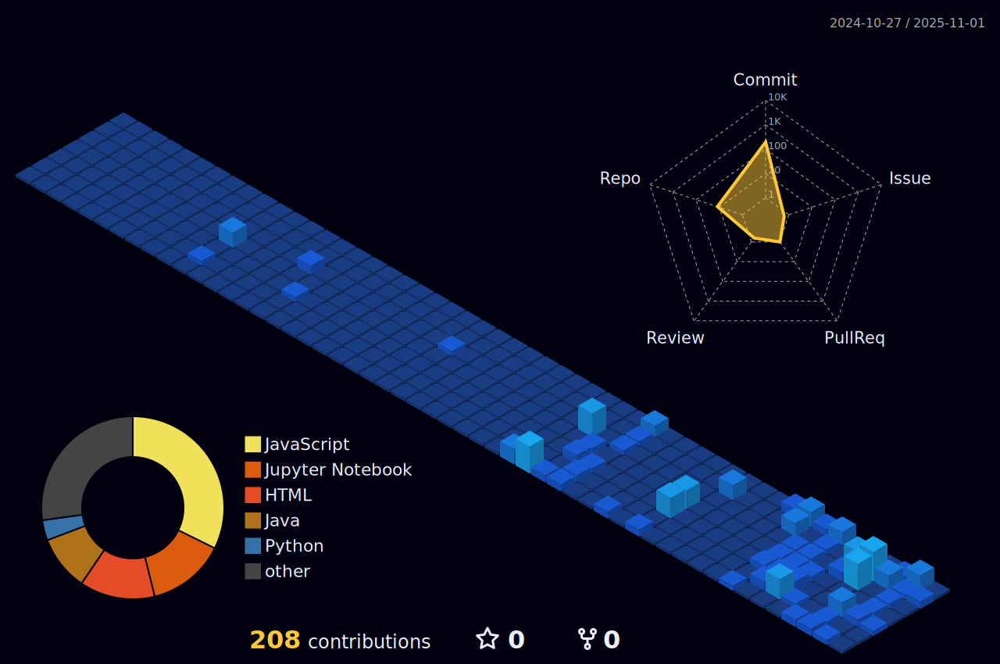

# Welcome to My GitHub Profile!
I'm Harishwar R, a passionate and innovative programmer with a deep interest in Artificial Intelligence, Machine Learning, and Data Science.  
I love building intelligent systems and solving real-world problems through code.

---

## Programmer | Vibe Coder | Algorithm Practitioner
<div align="center">

#  About Me

</div>

<table>
<tr>
<td width="50%" valign="top">

##  Profile
-  **3rd Year B.E. CSE (AI & ML)** student at **KIT** - Kalaignar Karunanidhi Institute of Technology
-  Passionate about **AI, ML, Data Science**, and **Full-Stack Development**
-  Winner of **IIT Madras - TN Hackathon X (NCSRC) 2025**
-  **1st Place** in "Code Detox" Technical Event at PPG College
-  Continuously learning and exploring new technologies
-  Strong foundation in **Python, DSA, OOPs, DBMS**, and **Deep Learning**

</td>
<td width="50%" valign="top">


</td>
</tr>
</table>

---
<div align="center">
### Let's build something amazing together!

</div>

---

## Tech Stack  

### AI & Machine Learning
<p align="left">


</p>

### Web Development
<p align="left">


</p>

### Databases & Tools
<p align="left">


---

<div align="center">

##  Competitive Programming Profiles

<table>
<tr>
<td width="50%" valign="top">

###  LeetCode Profile

<a href="https://leetcode.com/u/HwWfJcqe/">
  
</a>

<a href="https://leetcode.com/u/HwWfJcqe/" target="_blank">
  
</a>

<br/>

**Achievements**
- Dynamic Programming Expert
- Problem Solving Streak
- Active Contributor

</td>

<td width="50%" valign="top">

###  CodeChef Profile

<table align="center">
  <tr>
    <td align="center" colspan="2">
      
    </td>
  </tr>
  <tr>
    <td align="center">
      
    </td>
    <td align="center">
      
    </td>
  </tr>
  <tr>
    <td align="center">
      
    </td>
    <td align="center">
      
    </td>
  </tr>
  <tr>
    <td align="center" colspan="2">
      
    </td>
  </tr>
</table>

<a href="https://www.codechef.com/users/kit23bam023" target="_blank">
  
</a>

<br/>

**Achievements**
- 792 Problems Solved
- Peak Rating: 1555
- 83 Contests Participated
- 200+ Active Days

</td>
</tr>
</table>

---

<span style="font-size:16px;">Keep coding, keep growing! 💻</span>

</div>  

---

#  Featured Projects

<div align="center">

*Building impactful solutions at the intersection of technology and innovation*

</div>

---

##  Social Media and Mental Health Analyzer

[](https://github.com/TecqHarishKrish/Social_media_mental_health_tracker)

<table>
<tr>
<td width="60%">

### Overview
A comprehensive full-stack platform designed to analyze mental health patterns through social media metrics, providing actionable insights for better well-being.

###  Key Highlights
- ** 3rd Prize Winner** - IIT Madras TN Hackathon X 2025
- Real-time tracking of social connections and engagement patterns
- Interactive visual dashboards with data-driven mental health insights
- Automated email notification system for user engagement

###  Technical Architecture
- **Frontend:** React, TypeScript
- **Backend:** Node.js, Express.js
- **Database:** MongoDB
- **APIs:** RESTful Services

</td>
<td width="40%" align="center">

```
┌─────────────────┐
│   React UI      │
└────────┬────────┘
         │
┌────────▼────────┐
│  Express API    │
└────────┬────────┘
         │
┌────────▼────────┐
│    MongoDB      │
└─────────────────┘
```

**Impact Metrics**
-  Real-time Analysis
-  Visual Insights
-  Smart Alerts

</td>
</tr>
</table>

---

##  Offline Resume RAG Chatbot

[](https://github.com/TecqHarishKrish/Offline-Resume-Rag-chatbot)

<table>
<tr>
<td width="40%" align="center">

###  Core Features

```
Privacy-First
    ↓
Local Processing
    ↓
Smart Analysis
    ↓
Natural Q&A
```

**Tech Stack**
- LangChain
- Hugging Face
- FAISS
- Streamlit

</td>
<td width="60%">

### Overview
An intelligent, privacy-focused chatbot that processes and analyzes resumes entirely offline, ensuring complete data security while providing natural language interactions.

###  Key Features
- ** 100% Offline** - Complete local processing for maximum privacy
- ** Smart PDF Parsing** - Advanced document analysis and extraction
- ** Natural Interactions** - Conversational AI for resume queries
- ** Context-Aware** - Intelligent understanding of resume content

###  Technology Stack
Built with cutting-edge NLP and vector search technologies for optimal performance without internet dependency.

</td>
</tr>
</table>

---

##  Predicting Neonatal Diseases

[](https://github.com/TecqHarishKrish/Predicting_Neonatal_Diseases)


<table>
<tr>
<td width="60%">

### Overview
An AI-driven early detection system leveraging deep learning to identify potential health complications in newborns, enabling timely medical intervention.

###  Key Capabilities
- ** Deep Learning Models** - CNN and LSTM architectures for pattern recognition
- ** Multi-modal Analysis** - Physiological and clinical data processing
- ** Early Detection** - Predictive insights for proactive healthcare
- ** Clinical Impact** - Improved outcomes through timely intervention

###  Technical Foundation
- **Data Processing:** Pandas, NumPy
- **Deep Learning:** Keras, TensorFlow
- **Model Architecture:** CNN + LSTM hybrid approach

</td>
<td width="40%" align="center">

###  Model Pipeline

```
Clinical Data Input
       ↓
Data Preprocessing
       ↓
Feature Engineering
       ↓
CNN + LSTM Models
       ↓
Risk Prediction
       ↓
Clinical Insights
```

**Application Areas**
-  Respiratory Issues
-  Cardiac Conditions
-  Metabolic Disorders

</td>
</tr>
</table>

---

##  Android Game Development

[](https://github.com/TecqHarishKrish/Gaming-Platform)


<table>
<tr>
<td width="40%" align="center">

###  Design Philosophy

```
Engaging
   +
Intuitive
   +
Optimized
   ↓
Exceptional UX
```

**Built With**
- Android Studio
- Java
- Material Design

</td>
<td width="60%">

### Overview
An immersive mobile gaming experience crafted with attention to detail, featuring smooth gameplay mechanics and an intuitive interface optimized for Android devices.

###  Highlights
- ** Polished UI/UX** - Clean and intuitive interface design
- ** Performance Optimized** - Smooth gameplay across devices
- ** Engaging Mechanics** - Interactive and responsive gameplay
- ** Mobile-First** - Designed specifically for touch interfaces

###  Development Stack
Native Android development with modern Java practices and Material Design principles.

</td>
</tr>
</table>

---

<div align="center">

###  *Driven by curiosity, powered by code*

**[View More Projects →](#)** | **[Get In Touch →](#)**

</div> 

---

## Certifications & Achievements

| Certification | Provider |
|---------------|----------|
| IIT Madras TN Hackathon X 2025 - 3rd Prize | IIT Madras-NCSRC |
| Code Detox - 1st Place Technical Event | PPG College |
| Joy of Computing using Python (Elite) | NPTEL |
| Prompt Engineering | Coursera |
| Machine Learning with Python | IBM |

---

## GitHub Statistics  
  
  
  

### GitHub Contribution Snake  
<div align="center">
  <picture>
    <source media="(prefers-color-scheme: dark)" srcset="https://raw.githubusercontent.com/TecqHarishKrish/TecqHarishKrish/output/github-snake-dark.svg" />
    <source media="(prefers-color-scheme: light)" srcset="https://raw.githubusercontent.com/TecqHarishKrish/TecqHarishKrish/output/github-snake.svg" />
    
  </picture>
</div>

---

## Let's Connect!  
  
  
  
  
  

---

> "Innovation distinguishes between a leader and a follower." – Steve Jobs  

⭐ Feel free to explore my repositories and don't forget to star if you find something interesting! ⭐  

---

**Last Updated: October 2025**

<p align="center">
<div align="center">
<a href="https://github.com/TecqHarishKrish"> 
 
</a>
<br/><br/>
<a href="https://github.com/TecqHarishKrish">


  
</a>
<br/><br/>
<a href="https://github.com/TecqHarishKrish"> 

</a>
<br/><br/>
<a href="https://github.com/TecqHarishKrish">

</a>
<br/>
<a href="https://github.com/TecqHarishKrish">

</a>
<br/><br/>
</div>
</p>

<table>
<tr>
<td width="50%" valign="top">


