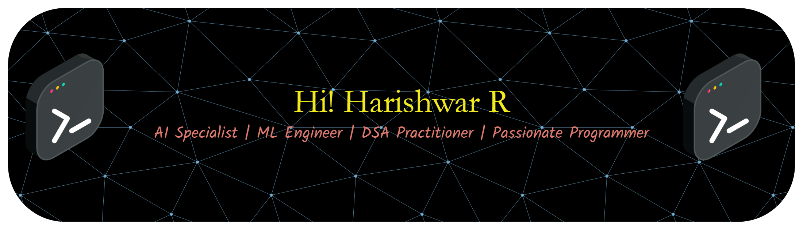

# Welcome to My GitHub Profile!
I'm Harishwar R, a passionate and innovative programmer with a deep interest in Artificial Intelligence, Machine Learning, and Data Science.  
I love building intelligent systems and solving real-world problems through code.

---

## Programmer | Vibe Coder | Algorithm Practitioner

#  About Me

<table>
<tr>
<td width="50%" valign="top">

##  Profile
-  **3rd Year B.E. CSE (AI & ML)** student at **KIT** - Kalaignar Karunanidhi Institute of Technology
-  Passionate about **AI, ML, Data Science**, and **Full-Stack Development**
-  Winner of **IIT Madras - TN Hackathon X (NCSRC) 2025**
-  **1st Place** in "Code Detox" Technical Event at PPG College
-  Continuously learning and exploring new technologies
-  Strong foundation in **Python, DSA, OOPs, DBMS**, and **Deep Learning**

</td>
<td width="50%" valign="top">

</td>
</tr>
</table>

---

### Let's build something amazing together!

---

## Tech Stack  

### AI & Machine Learning

### Web Development

### Databases & Tools

---

## Competitive Programming Stats

### CodeChef Profile  
  

- Highest Rating: 1555 (3★)  
- Global Rank: 21,770  
- Country Rank: 19,608  
- Problems Solved: 792+  
- Contests Participated: 83  
- Badges: Gold (Contest Contender & Problem Solver)  

### LeetCode Profile  
  

- Contest Rating: 1,414 (Top 20.41%)  
- Problems Solved: 147+  
- Easy: 68/907 | Medium: 71/1932 | Hard: 8/876  
- Active Days: 106 | Max Streak: 52 days  
- Badges: 50 Days Badge 2025  

---

## Featured Projects

### Social Media and Mental Health Analyzer  
A full-stack platform for mental health analysis through social media metrics  

**Tech:** React, TypeScript, Node.js, Express.js, REST APIs, MongoDB  
- 3rd Prize Winner at IIT Madras TN Hackathon X 2025  
- Real-time social connection tracking and engagement analysis  
- Visual dashboards with actionable mental health insights  
- Integrated email utilities for user notifications  

---

### Offline Resume RAG Chatbot  
Privacy-first chatbot for resume analysis and query answering  

**Tech:** LangChain, Hugging Face Transformers, FAISS, Streamlit  
- Complete offline functionality for data privacy  
- PDF parsing and intelligent query understanding  
- Natural language interactions about resume content  

---

### Predicting Neonatal Diseases  
AI-powered early detection system for newborn health complications  

**Tech:** Pandas, NumPy, Keras/TensorFlow, CNN, LSTM  
- Deep learning models for disease prediction  
- Analysis of physiological and clinical data  
- Improved healthcare outcomes through early intervention  

---

### Android Game Development  
Interactive mobile gaming experience  

**Tech:** Android Studio, Java  
- Engaging gameplay mechanics  
- Optimized for mobile devices  
- Clean and intuitive user interface  

---

## Certifications & Achievements

| Certification | Provider |
|---------------|----------|
| IIT Madras TN Hackathon X 2025 - 3rd Prize | IIT Madras |
| Code Detox - 1st Place Technical Event | PPG College |
| Joy of Computing using Python (Elite) | NPTEL |
| Prompt Engineering | Coursera |
| Machine Learning with Python | IBM |

---

## GitHub Statistics  
  
  
  

### GitHub Contribution Snake  

  <picture>
    <source media="(prefers-color-scheme: dark)" srcset="https://raw.githubusercontent.com/TecqHarishKrish/TecqHarishKrish/output/github-snake-dark.svg" />
    <source media="(prefers-color-scheme: light)" srcset="https://raw.githubusercontent.com/TecqHarishKrish/TecqHarishKrish/output/github-snake.svg" />
    
  </picture>

---

## Let's Connect!  
  
  
  
  
  

---

> "Innovation distinguishes between a leader and a follower." – Steve Jobs  

⭐ Feel free to explore my repositories and don't forget to star if you find something interesting! ⭐  

---

**Last Updated: October 2025**

  

  

  

 

  

